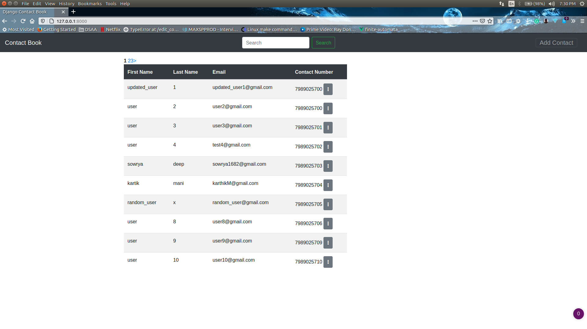
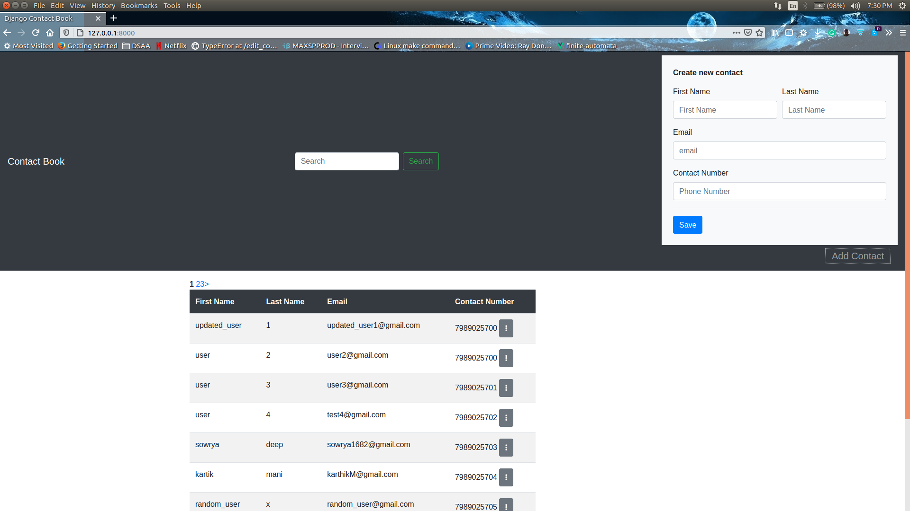
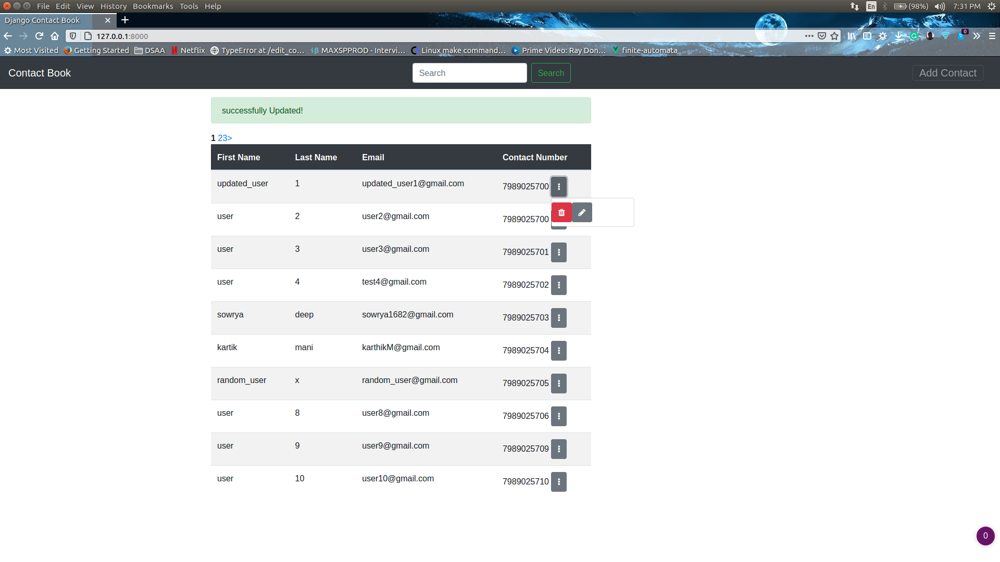
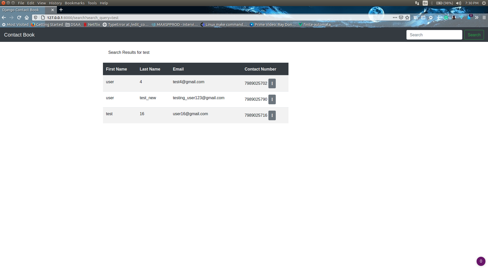
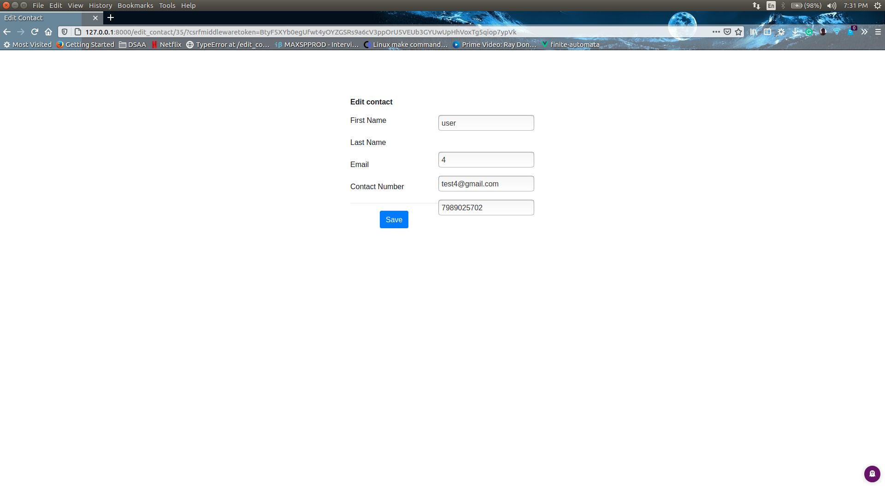

# Contact-Book

## Helpful Commands

- Recommended to use any Virtual environment tool.
- once inside `Contact-Book/django_project/` directory, use the command `pip install requirements.txt`.
- run `python manage.py makemigrations` in the command line for creating new migrations.
- run `python manage.py migrate` to apply the migrations.
- run `python manage.py runserver` for starting the development server.

### Main Page
# 

### Adding a Contact
# 

### deleting and Updating a contact
# 

### Search by username and email
# 

### Update Page
# 

